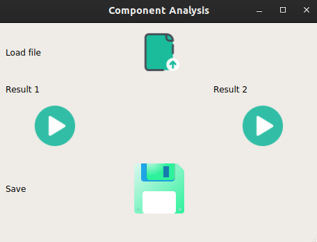

# Blind Source Separation

Basic Separation application that uses FastICA algorithm to separate a given source to it's main components. Application include player to play results also save the produced results in a file `/results` included in project directory.

**Important Note**

You'll need to close any application that might be using your sound card to ensure application's smooth performance.

## <u>Extraction</u>

Found in helpers, the necessary functions to load a wav file, play, save and extract components of that file. Applying  FastICA using `sklearn.decomposition` to a selected file and return the results.

## <u>Sources Included</u>

Sources included in `./cocktail`  are :

- `cocktailparty.wav` : Person + Music 
- `cocktailparty.wav` : 2 Persons 
- `Marshmello_Happier_18.wav` : Music + vocals 

## <u>Basic Usage</u>

Application's main screen consists of a simple load, play and save buttons. Simply load the desired ` wav` file then listen/save the results.

